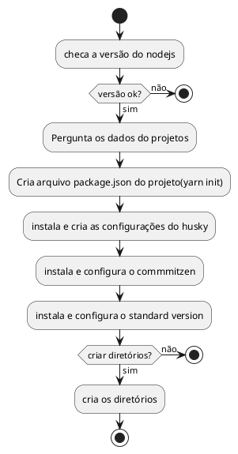

# História Sprint 01 - Inicial

## Inicio do projeto

O projetos de software deseja efetuar um esquema de modelos de instalação de software para que o repositório já venha com todos os esquemas iniciais de desenvolvimento de projeto. Isso se deve ao tempo necessário para subir as ferramentas em cada projeto.

Decidi então fazer esse projeto em [NodeJS](https://nodejs.org/en/) visto que todas as ferramentas utilizadas no projeto utiliza essa tecnologia. A questão é que elas não se limitam a ela, podendo ser extendida a outras linguagens e não gerando problemas posteriores no projeto. 

Para instalar o software é necessário instalar o nodejs acima da versão 16. Usa-se o comando abaixo: 

```bash
sudo npm install -g organizer
```

Na minha primeira concepção o ideal é que a ferramenta fizesse o seguinte comando para iniciar: 

```bash
organizer init 
```

O que é necessário criar no começo?

A primeira coisa que será desenvolvida é a função init:



- **Dados do Projeto**
  - Nome do Projeto (package.json)
  - Versão

- **Opções**
  - Pasta de Documentos para Sprint
    - docs
      - backlog
      - archive
      - sprints
      - publish
      - img

## Tasks

| Numero |                 Descrição                  | Status | Taiga |
| :----: | :----------------------------------------: | :----: | :---: |
|   01   |        Testar a Biblioteca Command         | aberto |       |
|   02   |        Testar a Biblioteca Prompts         | aberto |       |
|   03   | Escrever arquivos JSON a partir de objetos | aberto |       |
|   04   |    Entender sobre importação e módulos     | aberto |       |


### Tasks parte II

| Numero |                   Descrição                    | Status | Taiga |
| :----: | :--------------------------------------------: | :----: | :---: |
|   01   |   Criar Documento de Versionamento Semântico   | Aberto |       |
|   02   |          Criar Documento de Changelog          | Aberto |       |
|   03   |           Criar Documento de Commits           | Aberto |       |
|   04   | Escrever documento em inglês para o array JSON | Aberto |       |
|   05   |                Captura de dados                | Aberto |       |
|   06   |  Implementar a instação de pacotes por script  | Aberto |       |
|   07   |                Importar Idioma                 | Aberto |       |
|   08   |             Implementar Diretórios             | Aberto |       |
|   09   |          Escrever o Manual do Usuário          | Aberto |       |
|   10   |       Função de valição da versão nodejs       | Aberto |       |

